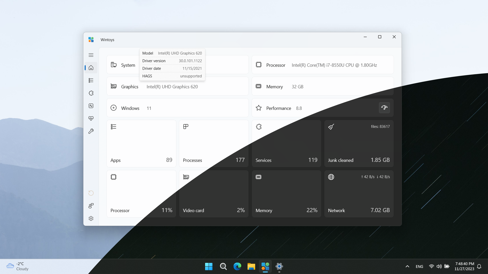

# Wintoys
Experience Windows in your way and keep it fresh every day. Set up, debloat, optimize, repair, and tweak your operating system in a simple, time-saving, yet safe approach. Maintain it in a clean, healthy and productive state while having everything you need in one place.

- Speed up your Windows and increase the framerate in certain games just by tweaking some settings.

- Keep your Windows clean and free up your storage using the built-in cleaner feature.

- Run the most advanced repair tools available in Windows in a few clicks. Bye bye terminal!

- Take control over ads and privacy related settings.

- Personalize your desktop and learn cool new features that are worth using in Windows.

- Uninstall any app, even those apps that don't have an uninstall option in Windows.

- Find out which services you don't need and safely disable them with only two clicks.

