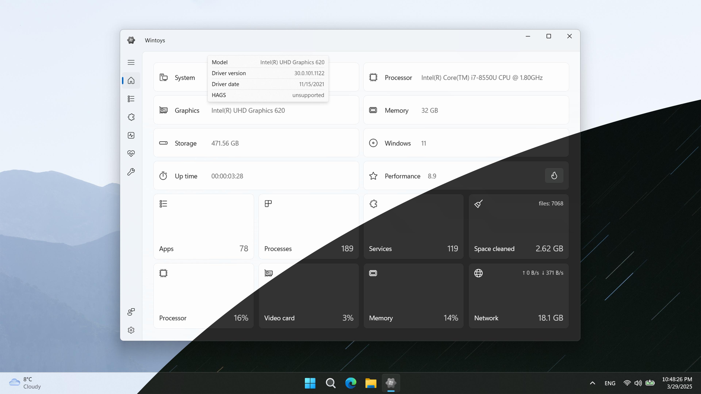

<h1 align="center" style="text-align: center;">Wintoys</h1>

  
  

<h5 align="center" style="text-align: center;">
  Unlock the full potential of the operating system and control every aspect of the experience in a safe and time-saving manner
</h5>

 

___

 

- optimize the performance of your device and increase the framerate in certain games by just tweaking some settings
  
- access hidden or obscured system settings

- keep Windows stable and free up disk space using the built-in cleaner

- run the most advanced repair tools available in Windows in a few clicks, bye bye terminal!

- take control over ads and privacy settings

- personalize your desktop and learn cool new features that are worth using

- uninstall any app, even those apps that don't have an uninstall option in Windows

- find out which services you don't need and safely disable them with only two clicks
  
- see specs about your device and statistics in real time

 

___

 

<h3 align="center" style="text-align: center;">
  media outlet reviews & tutorials
</h3>

<h4 align="center" style="text-align: center;" markdown="1">
  
  [Linus Tech Tips](https://youtu.be/0EtgwIajVqs?si=4ePAr8rZ_9EzwrRT&t=347) • [Windows Central](https://www.windowscentral.com/software-apps/wintoys-streamlined-bloatware-removal-and-quick-system-tweaks) • [Neowin](https://www.neowin.net/news/wintoys-offers-a-safe-and-easy-way-to-debloat-optimize-tweak-and-repair-windows-11) • [XDA](https://www.xda-developers.com/reasons-everyone-should-use-free-tool-customize-windows) • [Beebom](https://beebom.com/wintoys-every-windows-power-user-should-use) • [Pureinfotech](https://pureinfotech.com/wintoys-optimize-speed-up-windows-11) • [How-To-Geek](https://www.howtogeek.com/i-use-this-free-tool-as-my-go-to-solution-for-most-of-my-windows-needs)
  
</h4>

 

___

„_An amazing swiss-tool for your machine._”\
\- **Ferran**

„_Literally a lifesaver. [...] Streamlines hours of tweaking into minutes._”\
\- **Adam**

„_Way safer than the de-bloater alternatives. Love Wintoys._”\
\- **John**

„_It's a miracle that this is free, thank you so much!_”\
\- **Joe**

„_I usually only review a product if it's great or terrible. This one is great, and not because Linus said so, but because it is actually useful for me._”\
\- **Aaron**

„_Just came across this and my word the dev should be hired by Microsoft! The tool is more stable and reliable than Windows itself._”\
\- **Cameron**

„_Turned my laptop which was a bit of a ******* into a mini gaming machine._”\
\- **Isaiah**

„_This is basically running Windows on steroids. This should be the defacto tool for managing a new Windows installation. Every option explained clearly and even with links to official Microsoft documentation. These days Windows is easy to use, but this makes it 100x times easier._”\
\- **Warmachine**

„_This is a keeper, A++, 10/10, 5-Stars. There is a noticeable gain with performance and it literally freed up 200 gigs of space on my HDD archive drive within the first 10 minutes and 20-30 gigs on my SSD. Love this app!_”\
\- **Kjell**

„_This app is a must-have for Windows users. I love how it also contains all sorts of registry hacks and various mods I've known about and been manually doing for years, except now they're all in one convenient place. Really good selection of tweaks. Highly recommend! 👍_”\
\- **Alex**

„_I can't believe I can say I recommend anything on the Windows Store, and I don't particularly like debloating scripts (as they often leave out a lot of functionality without a disclaimer as to what they will screw up later) this really just has the basics of any user that would help them get an edge on their experience. Great for people that reinstall Windows and need to quickly reapply settings that are important._”\
\- **Sean**

„_This is Windows version of Stacer for Linux. I can imagine a lot of blood, sweat, and tears went into this. I'd buy the developer a cup of coffee for this, very handy and useful, highly recommend._”\
\- **Brian**

„_I am a professional computer technician [...] I install this on all the computers that I get for repairs or Windows installations. [..] This app works like magic. Just one click, and you get what you desire._”\
\- **Jayaditya**

„_I love the way this is set out and the handy explanations. Useful for beginners and experienced users, like me. You learn something new every day, as the saying goes._”\
\- **Ricky**

„_Stumbled up on this little gem of a Windows tweaker. No more Cortana. No more Bing search results in Start Menu. No more forced bloatware from Microsoft. Thank you!_”\
\- **Norbert**

„_Better uninstalling experience than the built-in one, sleek design, helpful and thoughtful tips, myriad options and tweaks, no agenda, efficient, responsive, all the good adjectives._”\
\- **Reda**

„_What the army of Microsoft developers should have made in the first place!_”\
\- **Jacques**

___

<h4 align="center" style="text-align: center;" markdown="1">
  
  💡 [changelog](changelog.md) &nbsp;&nbsp;&nbsp;&nbsp;&nbsp;&nbsp; ❓ [faq](faq.md) &nbsp;&nbsp;&nbsp;&nbsp;&nbsp;&nbsp; 🔒 [privacy policy](privacy.md)
  
</h4>

 

    &nbsp;

